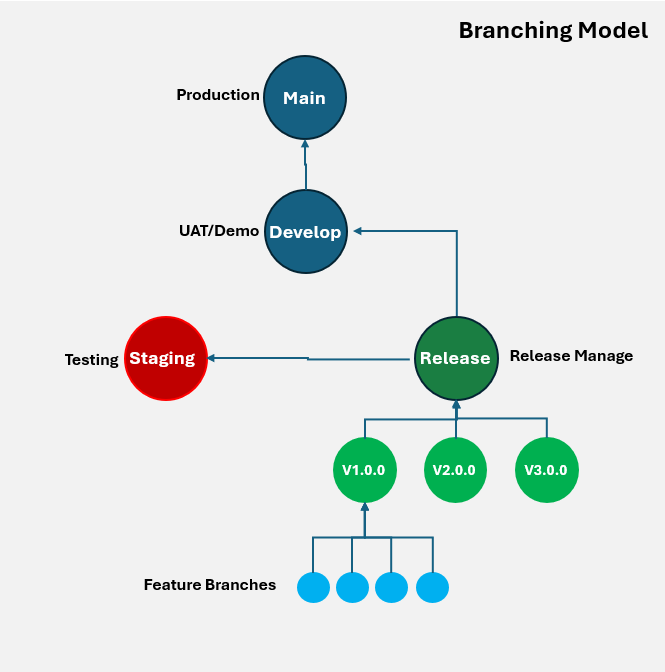
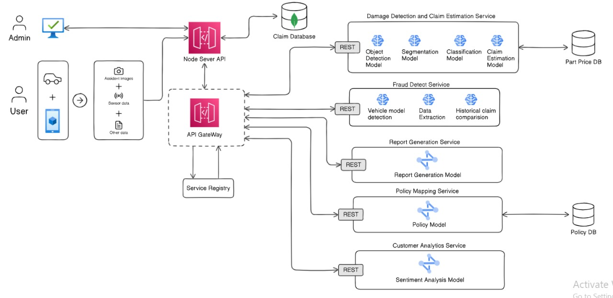

# Harnessing Multi-Modal AI for an Automated Vehicle Insurance Solution | V1.0.0

Research Group - 24-25J-321

Branching Model

Architecture Diagram

Product Repositories.

Flask Server - https://github.com/Hash-Perera/InsureGeini_AI

Mobile application - https://github.com/Hash-Perera/InsureGeini_Mobile

Web application - https://github.com/Hash-Perera/InsureGeini_Web

Node Server - https://github.com/Hash-Perera/InsureGeini_Backend
